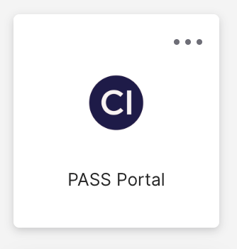
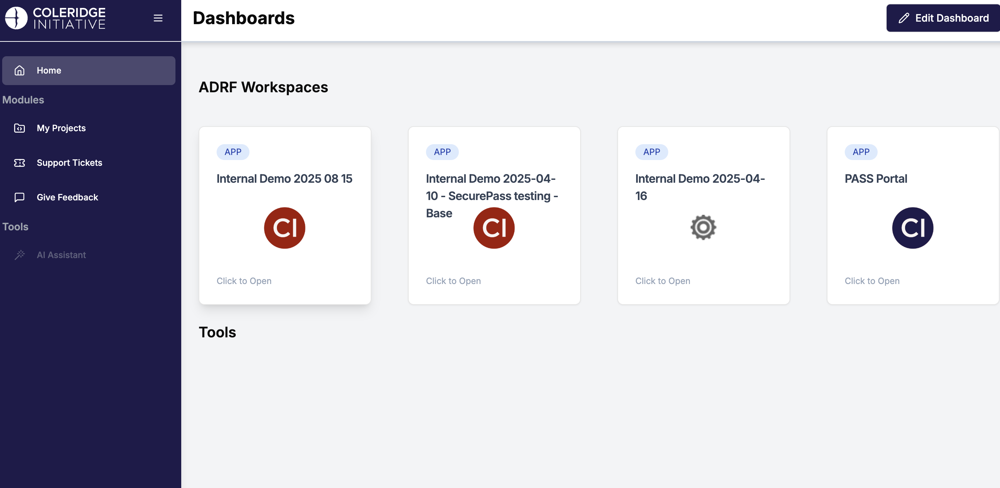
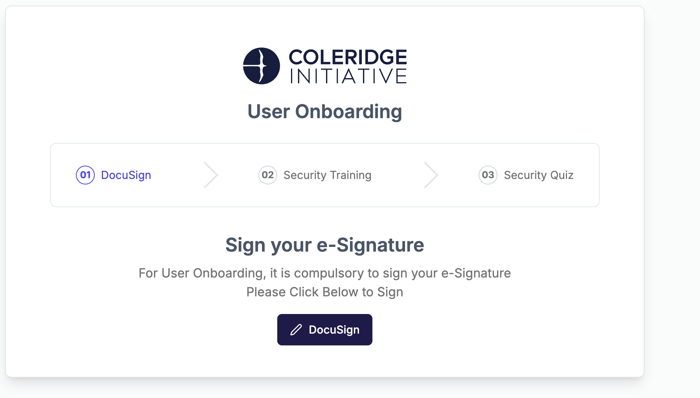
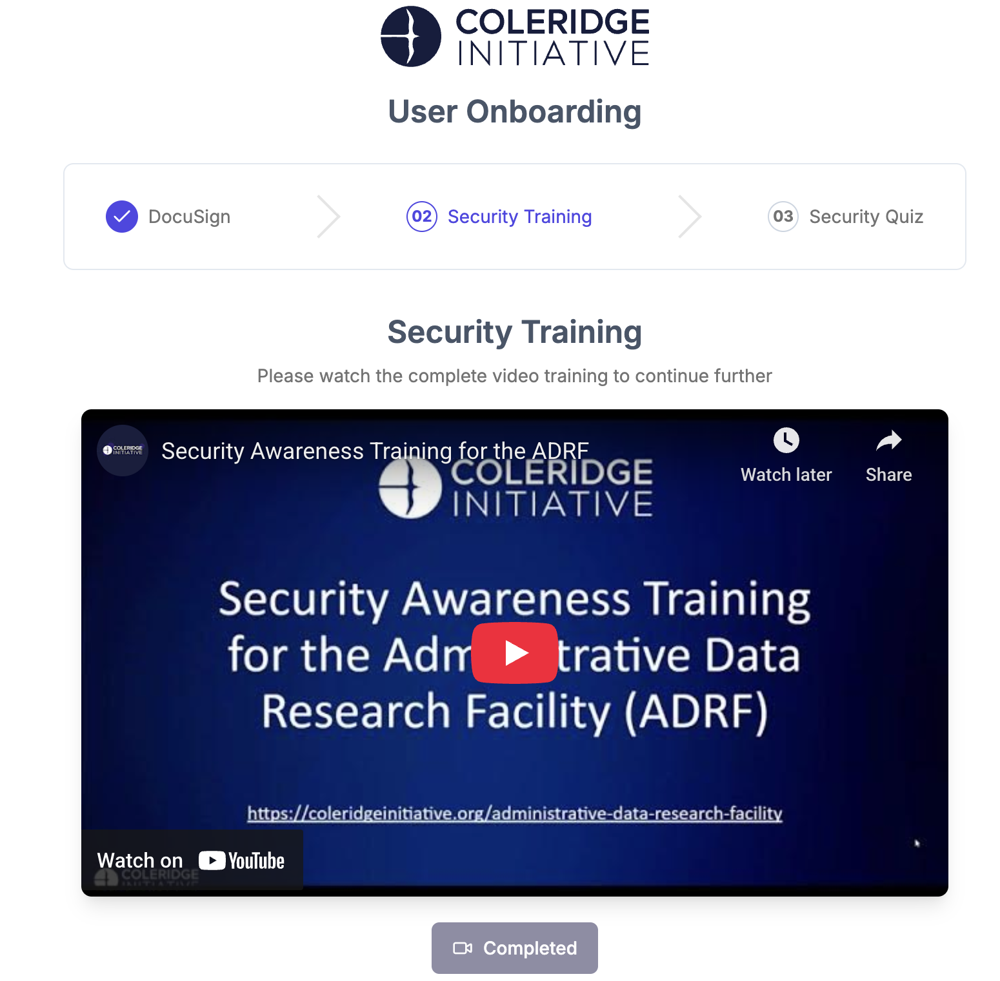
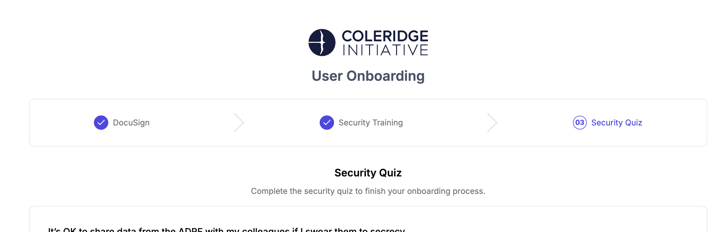

# 3 Onboarding Modules and Security Training

## Topics

-   [PASS Portal](#pass-portal)
-   [Accessing the Onboarding Tasks](#accessing-the-onboarding-tasks)

## Coleridge PASS (Privacy, Access, Safety, Security) {#pass-portal}

The Coleridge PASS web-based application is positioned primarily as the management and monitoring console for project and data stewards.
It provides detailed insight on project configurations, user activity, user onboarding status, and overall cost of a project on the ADRF.
We focus on four primary pillars of information a Project/Data Steward most often focuses on:

-   **People** – Who are the members of projects, how often do they use the ADRF, what exports have they requested and their status, estimated cost per person/project for current month and for the project since inception, and detailed usage metrics.

-   **Projects** – Details of project start/end dates, abstract description, number of members onboarded and pending, and resources the project has access to (i.e. datasets, etc).

-   **Datasets** – Description of the dataset, location on the ADRF (database or file system), size, name of the data steward(s), and the data catalog describing the dataset and metadata.

-   **Agreements** – What agreements are related to these projects, indication of each member’s signing status, members pending signature, and term (dates) covered by the agreement(s).

As mentioned, the PASS portal application will track your ADRF usage.
The portal will also consolidate your ADRF Terms of Use, Security Training Quiz, and Security Training Video into one place.
In order to complete ADRF onboarding, all three of the mentioned tasks are to be completed by the user (researcher).
To access the PASS Portal, log in using your credentials at https://adrf.okta.com and click on the PASS Portal icon:

Once inside the PASS Portal, you have access to your personal workspace sessions statistics along with admin tasks such as the three onboarding tasks and password management.
See the example below:

## Accessing the Onboarding Tasks {#accessing-the-onboarding-tasks}

To gain access to your ADRF project workspace, you must first complete 3 required ADRF onboarding tasks:

1.  **Signing the ADRF Terms of Use agreement**.
    Users must comply with the Terms of Use when working in the ADRF.
    The Agreement covers rules of behavior within ADRF and guidelines for discussing ADRF content prior to passing disclosure review.
    It asks users to agree to a series of principles governing dataset use, behavior, and data export procedures, and to acknowledge the consequences of violating the Terms.

2.  **Completing security awareness training**.
    Users will get access to a security awareness video and should confirm that they have reviewed the video.
    The video covers security content that is then assessed during the security awareness quiz.

3.  **Passing the security awareness quiz**.
    The security awareness quiz consists of a set of 6 questions.
    Users must achieve a score 5 out of 6 to pass the quiz.
    Unsuccessful users can retake the quiz to achieve a passing score.

## Accessing the Onboarding Tasks

Follow the steps below to access the **ADRF Onboarding Tasks**:

1.  Log in to the PASS Portal

2.  Once open, the onboarding tasks will appear and then click on "DocuSign":

3.  This will load a document to sign:

4.  Once signed, this will load the **Security Training Video**.

5.  Once finished, the Completed icon will illuminate. The final task is the security quiz:

***

[⬅️ Previous: Obtaining ADRF Access](02-access.md) \| [Back to Home](index.md) \| [Next: How to Access and Use Your Project Workspace➡️](04-access-and-use.md))
