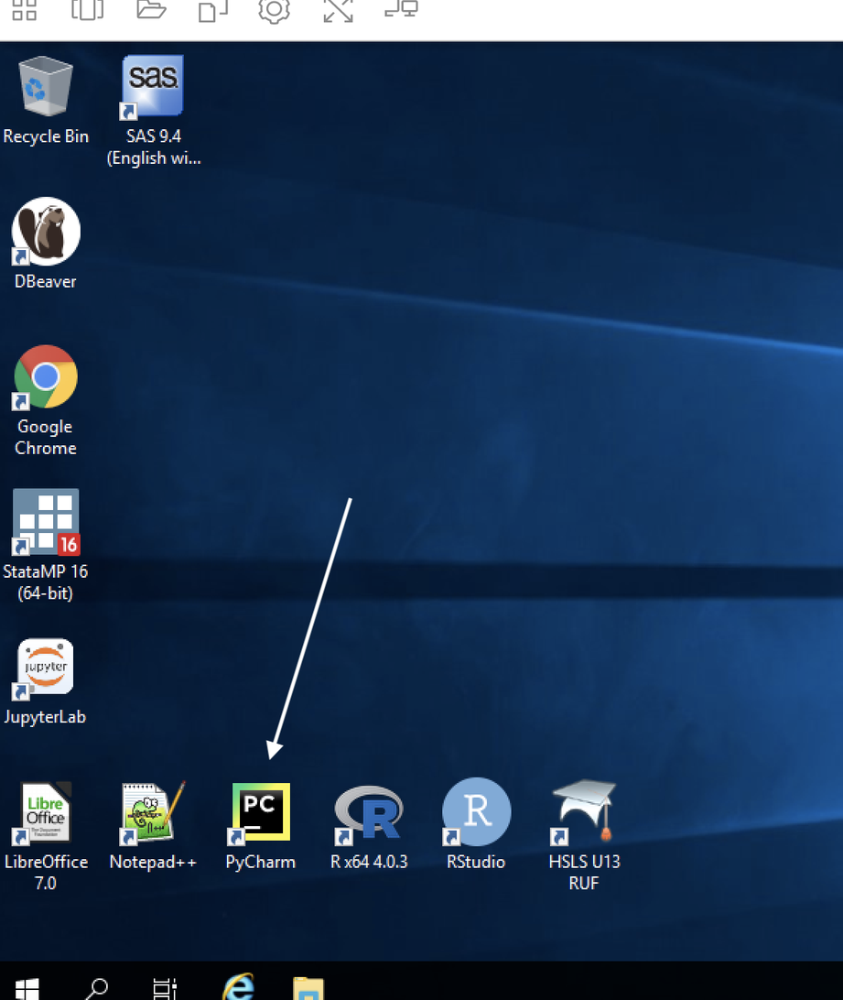

# 4 How to Access and Use Your Project Workspace

A **project workspace** is a secure, isolated virtual environment in the ADRF within which an approved set of users can access a defined number of agency datasets. The project workspace is designed to allow approved researchers to access, analyze, and manipulate specific datasets relevant to their approved projects while maintaining strict data confidentiality and integrity. 

Project workspaces in the ADRF are isolated from each other. Even if a person is granted access to two project workspaces, the user can not access or copy files from one into the other. This is important because the two project workspaces might have access to different datasets. 

## Topics
- [Logging into and Logging out of the ADRF](#logging-into-and-logging-out-of-the-adrf)
- [Virtual Desktop Environment](#virtual-desktop-environment)
- [Software in the ADRF](#software-in-the-adrf)

## Logging into and Logging out of the ADRF
This video linked below runs through the necessary steps for logging into and logging out of the ADRF.

To watch the video, **right-click the image below** and choose **"Open link in new tab"** (by right-cicking, you will avoid leaving this page).

## Virtual Desktop Environment
### What is a VDE?
A **virtual desktop environment (VDE)** allows you to interact with a remote system as if it were your own personal computer. The majority of your standard desktop functions are available, but the programs, data, and permissions are all controlled by the remote administrator (Coleridge Initiative). Thus, you will be working in a familiar environment while accessing protected data, programs, and systems that would otherwise be difficult to distribute. The ADRF uses a standard Windows environment (Windows Server) and provides a variety of software packages to conduct your analysis. For more on Windows capabilities, see the section on Windows Settings.

### Temporary Nature of the Environment
While the environment is similar to that on your home computer (for Windows users), there are a handful of key differences. The first is that the environment is temporary in nature. This means that if you are not using it for a prolonged period of time (default is four hours but can vary by project), running programs will stop running and the information stored in temporary locations will be deleted. You will receive on on-screen message before any sessions are terminated. For more on safe, non-temporary storage locations in the ADRF, see the section on Storing Analytic Results.

Given the temporary nature of the ADRF, it is crucial to make sure that your work is saved—and saved in an appropriate location. Once this is complete and you are finished working, make sure that you log out of the ADRF instead of closing the window. To do this, click the rightmost icon on the top taskbar to open up the dropdown menu and select End Session. You will be prompted to double-check that your work is saved prior to ending your session and confirm that you want to end your session.

### Modifying the Environment
#### Establishing Personal Folders
Establishing your own personal folders is one of the simplest, yet most important, steps to take when setting up your environment. As we note in the section on Storing Analytic Results, the two possible places to store your analytic results or files are in either the U: drive or the P: drive.

You will find your personal folder in the U: drive. The folder name will include your Firstname and Lastname, and may additionally include your project workspace number. This is a personal workspace that only you can access in the ADRF.

##### The U: Drive and the P: Drive
The U: drive is your user drive; it’s where you will store any files you are working on. Only the user will have access to the U: drive. For example, if user A wants to share information with user B who is on the same project, user A will need to save files to a P: drive folder and not folders in their U: drive since user B will not be able to access user A’s U: drive.

The P: drive is the project drive, which will be used to house project-specific folders. Thus, you and other collaborators on the same project will be able to save files to project drive folders.

Both the U: drive and P: drive have defined resource limitations of 150GB. When the workspace exceeds these limits, users will not be able to create new files or save data. The ADRF will not alert users when they approach on 150GB used. Users can check their current usage by right clicking on the user folder and clicking on properties.

#### Other Modifications
The top taskbar contains shortcuts to the command prompt, multiple desktop windows, a temporary folder, settings, full-screen view, and toggling multiple monitors.

### Windows Settings
Your desktop will look familiar if you are a Windows user. You will have icons for quick access to programs or browsers on your desktop. The windows icon on the bottom left side of the screen will open up a menu of programs, folders, and other tools, much as you would see on your own desktop. You will have access to PowerShell and several customization settings (e.g., remove bottom taskbar).

## Software in the ADRF
### JupyterLab
**JupyterLab** provides flexible building blocks for interactive, exploratory computing. While JupyterLab has many features found in traditional integrated development environments (IDEs), it remains focused on interactive, exploratory computing. For more on JupyterLab, see the interface documentation.

The JupyterLab interface on the ADRF consists of a main work area containing tabs of documents and activities, a collapsible left sidebar, and a menu bar. The left sidebar contains a file browser, the list of running terminals and kernels, the table of contents, and the extension manager.

When using Jupyter Notebooks, make sure that all your work is saved to your U: drive and the correct director within the U: drive. You can “nd the active directory by reading the path displayed in the file browser. By default, JupyterLab opens with your U: drive as the base directory. Below, the folder icon in the white box is my user folder (not displayed, but titled `Firstname.Lastname`; you will have already set up your folder) and subfolder WDQI.

#### Notebooks
Jupyter Notebooks are documents that combine live runnable code with narrative text (Markdown), equations (LaTeX), images, interactive visualizations, and other rich output. You can create a notebook by clicking the blue + button in the file browser and then selecting a kernel (R, Python3, Stata) in the Launcher tab. For more information on getting started with Jupyter Notebooks, see JupyterLab Notebook documentation.

#### Accessing Stored Data from a Notebook
A common question is how to access stored data while writing to and using a Jupyter Notebook. Data in the ADRF are stored in a database using Microsoft SQL Server. For more information on how to access stored data in the ADRF based on choice of program (Python, R, Stata), see the section on Accessing Your Data.

### Python 3
Python is a general-purpose programming language. You can access Python in a multitude of ways:

1. **Through JupyterLab**. This is the **recommended way** to access Python since it has packages installed and available, and an execution environment for testing and running code (as well as a place to write and save code). Open JupyterLab and make sure your directory is set appropriately in the “le browser. Once there, in your new Launcher window, click the Python 3 icon.

2. **Through the start menu (windows icon)**. Type in Python. A desktop app called Python 3.7 (64-bit) will populate a window where you can begin programming.

3. **Through the command prompt in the top taskbar**. Once the command prompt window is open, type in python.

4. **Through Pycharm**

### R

**R** is a general-purpose programming language. You may access R in one of three ways:

1. **Through RStudio**. This is an integrated development environment (IDE) for R. You can run R code, display variables, debug R code, do inline visualizations, and more. Open RStudio through the desktop shortcut, or type RStudio in the start menu.
   
2. **Through JupyterLab**. Open JupyterLab and make sure your directory is set appropriately in the file browser. Once there, in your new Launcher window, click the R icon.

3. **Through the R GUI (graphical user interface)**. Type R in the search bar and click to open the RGui.

### Stata
**Stata** is a general-purpose statistical so#ware package. Stata can be accessed through the desktop shortcut StataMP 16 or by searching for it using the search or menu bar, or through JupyterLab.

### DBeaver
**DBeaver** is a universal tool for querying, editing, and managing data stored in Redshift databases. The ADRF stores data using AWS Redshift Server. DBeaver can be accessed through the desktop shortcut DBeaver or by looking it up using the search bar.

Once open, you will need to connect to a Redshift server. Please follow the directions in the [Redshift Querying Guide](11-querying-guide.md) to connect to the appropriate server.

***

[⬅️ Previous: Onboarding Modules and Security Training](03-onboarding.md) | [Back to Home](index.md) | [Next: How to Access Data ➡️](05-access-data.md)
