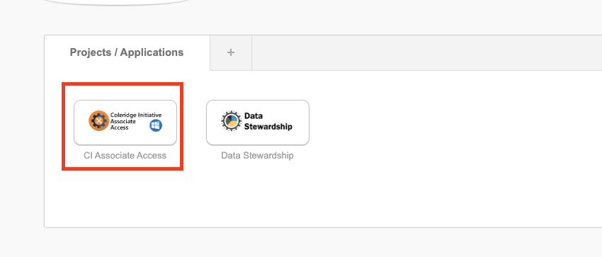
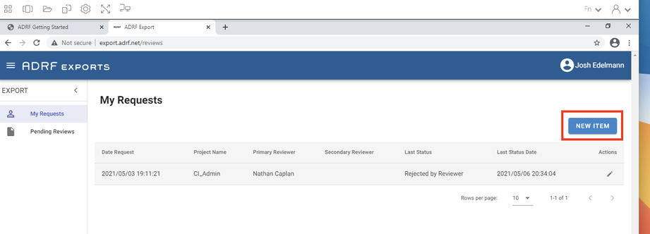
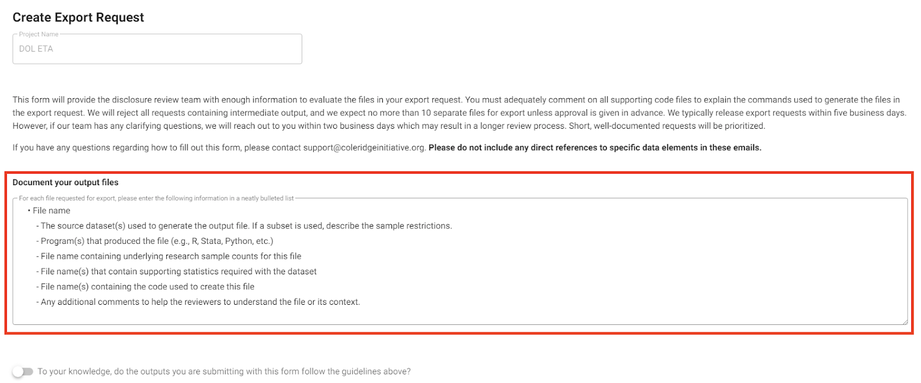

# 8 How to Export Output from the ADRF

To provide ADRF users with the ability to draw from sensitive data, results that are exported from the ADRF must meet rigorous standards meant to protect privacy and confidentiality.
To ensure that those standards are met, the ADRF Export Review team reviews each request to ensure that it follows formal guidelines that are set by the respective agency providing the data in partnership with the Coleridge Initiative.
Prior to moving data into the ADRF from the agency, the Export Review team suggests default guidelines to implement, based on standard statistical approaches in the U.S. government [^1],[^2] as well as international standards [^3], [^4], an
d [^5]. The Data Steward from the agency supplying the data works with the team to amend these default rules in line with the agency’s requireme
nts. If you are unsure about the review guidelines for the data you are using in the ADRF or if you have any questions relating to exports, please reach out to [support\@coleridgeinitiative.org](mailto:support@coleridgeinitiative.org) before submitting an export requ
est.

[^1]: Confidential Information Protection and Statistical Efficiency Act of 2002.
    (Washington, DC: U.S. GPO, 2002).

[^2]: Federal Committee on Statistical Methodology.
    “Report on Statistical Disclosure Limitation Methodology,” 22 (Second Version, 2005).
    <https://nces.ed.gov/fcsm/pdf/spwp22.pdf>.

[^3]: “How to Use Microdata Properly: Self-Study Material for the Users of Eurostat Microdata Sets.” (2018).
    <https://ec.europa.eu/eurostat/web/microdata/overview/self-study-material-for-microdata-users>.

[^4]: Research Data Centre of the German Federal Employment Agency at the Institute for Employment Research.
    “Remote Data Access and On-Site Use at the FDZ of the BA at the IAB.” (2020, December 8).
    <http://doku.iab.de/fdz/access/Vorgaben_DAFE_EN.PDF>.

[^5]: Welpton, Richard.
    Handbook on Statistical Disclosure Control for Outputs.
    (figshare, 2019).
    <https://doi.org/10.6084/m9.figshare.9958520.v1>.

To learn more about limiting disclosure more generally, please refer to the [Big Data and Social Science textbook](https://textbook.coleridgeinitiative.org) or right-click [here to view Coleridge's Privacy and Confidentiality video series](https://www.youtube.com/playlist?list=PLCtgqmGgzkEzwdPYKfrNHtOKFu3P5ErrU).

Note: The Export Requester cannot be assigned as a reviewer of the same export.

## Topics {#topics}

-   [8 How to Export Output from the ADRF](#8-how-to-export-output-from-the-adrf)
    -   [Topics](#topics)
    -   [General Best Practices for a Successful Export](#general-best-practices-for-a-successful-export)
    -   [Timelines for Export Process](#timelines-for-export-process)
    -   [Export Review Process](#export-review-process)
    -   [How to Check Your Export Review Status:](#how-to-check-your-export-review-status)
        -   [Review status descriptions](#review-status-descriptions)
    -   [Preparing Data for Export](#preparing-data-for-export)
        -   [Tables](#tables)
        -   [Graphs](#graphs)
        -   [Model Output](#model-output)
    -   [Submitting an Export Request](#submitting-an-export-request)

## General Best Practices for a Successful Export {#general-best-practices-for-a-successful-export}

**Note**: Currently, the review process is highly manual: Reviewers will read your code and view your output files, which may be time-consuming.

1.  Each additional release adds disclosure risk and therefore limits subsequent releases; we ask that users limit the number of files they request to export to just the outputs necessary to produce a particular report or paper.
2.  The reviewers may ask you to make changes to your code or output to meet the requirements of guidelines that have been given by the providers of the data in the ADRF.
3.  We ask that you only request review of final versions of output files, rather than in-progress versions. Any file containing intermediate output will be rejected.
4.  Every code file should have a header describing the contents of the file, including a summary of the data manipulation that takes place in the file (e.g., regression, table or figure creation, etc.).
5.  Documenting code by using comments throughout is helpful for disclosure reviews. The better the documentation, the faster the turnaround of export requests. If data files are aggregated, please provide documentation on the level of aggregation and for where in the code the aggregation takes place.
6.  To help reviewers, who may not have seen your code before, we ask that users create meaningful variable names. For instance, if you are calculating outflows, it is better to name the variable “outflows” than to name it “var1.”

## Timelines for Export Process {#timelines-for-export-process}

1.  Coleridge reviewers have five business days to complete an export from the day you submit an export request. However, timelines may differ depending on your agency, so please refer to your specific agency’s guidelines.
2.  The review process can be delayed if the reviewer needs additional information or if the reviewer needs you to make changes to your code or output to meet the ADRF nondisclosure requirements.

## Export Review Process {#export-review-process}

The ADRF Export Review process typically involves two main stages:

1.  **Cursory Review**: This is an initial, cursory review of your documentation and exports to ensure they do not include micro-data. A primary review can take **up to 5 business days**, so please plan accordingly when submitting your materials. In cases where the reviewer has questions or requires additional information, the cursory review **may extend beyond 5 business days**.
2.  **Comprehensive Review**: This is a comprehensive review conducted by an approved Data Steward who has content knowledge for the data permissioned to your workspace. If your submission pertains to **multiple data assets**, it will require approval by each Data Steward before the material can be exported from the ADRF. Please plan accordingly.

## How to Check Your Export Review Status: {#how-to-check-your-export-review-status}

If you’ve submitted an export request, you can easily check the status of your submission by following these steps:

1.  Log into the ADRF.
2.  Open the ADRF Export module.

### Review status descriptions {#review-status-descriptions}

To help you better understand the different stages of the Export Review process, here are the status descriptions you may encounter:

1\.
**Awaiting Reviewer**: Your export is currently under cursory review.
If any issues arise during the primary review, your reviewer will notify you.
Upon completion of the cursory review, the comprehensive reviewer(s) will be notified.

2\.
**Awaiting Secondary Review**: Your export is currently under comprehensive review.
If your submission pertains to multiple data assets, it will require a review by each Data Steward before being approved.

## Preparing Data for Export {#preparing-data-for-export}

Each agency has specific disclosure review guidelines, especially with respect to the minimum allowable cell sizes for tables.
Refer to these guidelines when preparing export requests.
If you are unsure of what guidelines are in place for the dataset with which you are working in the ADRF, please reach out to [support\@coleridgeinitiative.org](mailto:support@coleridgeinitiative.org)

### Tables {#tables}

-   **Cell Sizes**:
    -   For individual-level data, please report the number of observations from each cell.
    -   If your table includes row or column totals or is dependent on a preceding or subsequent table, reviewers will need to take into account complementary disclosure risks—that is, whether the tables’ totals, or the separate tables when read together, might disclose information about individuals in the data in a way that a single, simpler table would not. Reviewers will work with you by offering guidance on implementing any necessary complementary suppression techniques.

### Graphs {#graphs}

-   Graphs are representations of tables. Thus, for each graph (which may have, e.g., a jpg, pdf, png, or tif extension), provide the source data of the underlying table of the graph following the guidelines for tables above.
-   Because graphs and other figures take the most time to review, the number of generated graphs should be as low as possible. Please consider the possibility that you could export the underlying table instead, and generate the graph in another package.
-   If a graph is produced from aggregated data or from tables that have been disclosure-proofed following the guidelines above (e.g., bar charts of magnitudes), provide the underlying tables.
-   If a graph is produced directly from unit-record data but aggregated in the visualization (e.g., frequency histograms), provide the underlying tables.
-   If a graph is produced directly from unit-record data and displays unit-record values (e.g., scatterplots, plots of residuals), the graph can be released only after you ensure that individuals cannot be re-identified and that values can only be estimated with a high level of uncertainty. Further processing to meet this requirement can include, but is not restricted to, cutting off the tails of a distribution, removing outliers, jittering the actual values, and removing or modifying axis values.
-   If a graph is produced from the results of modeling or derivation and uses the unit-record data (e.g., regression curves), the graph can be released only if the values cannot be used to find original data values.
    -   Graphs of this type are generally automatically cleared.
    -   For precision/recall graphs, you will need to report the sample size used to generate your model(s).

### Model Output {#model-output}

Output from regression or machine-learning models generally does not pose a risk of disclosing personally identifiable information, as long as the models are not based on small samples.
Provide the counts for each variable that produces the model output.
If categorical variables are used then provide the counts for each category.

## Submitting an Export Request {#submitting-an-export-request}

To request an export be reviewed, please follow the instructions below or you can watch an instructional video by [right-clicking this link](https://www.youtube.com/watch?v=qXG_i0v_bDQ).

1.  Log into the ADRF (<http://adrf.okta.com>).
2.  Input your login credentials.
3.  Verify yourself with Okta (download Okta Verify on your smartphone or other device).
4.  Choose your project as seen in the photo below. For the purpose of this document, you are seeing the Coleridge Initiative Associate Access project. 
5.  Select Desktop and login with the same credentials you had done previously.
6.  Upon entering the ADRF, a Google Chrome page will appear as shown in the photo below (the **Getting Started** page). On this page, click on the **Export Request** tile. Or, from the ADRF desktop, open Google Chrome and navigate to export.adrf.net. (Note: [export.adrf.net](export.adrf.net) is an address that will only work within the ADRF desktop). 
7.  Click **My Requests**, or the top (person-shaped) icon, at the left side of the window as shown in the screenshot below. 
8.  Click **New Item** as shown below 

-   You will be asked to select the project to which your export relates. If you do not see the correct project listed in the drop down list, please reach out to our support team at [support\@coleridgeinitiative.org](mailto:support@coleridgeinitiative.org).

9.  After selecting a project, click **Continue**. 
10. Read through the entire page that loads. This page, titled “Create Export Request,” will ask for you to comment on all supporting code files to explain the commands used to generate the files in the export request. The Export Review team will reject all requests containing intermediate output. The Export Review team will typically release export requests within five business days. However, if the team has any clarifying questions, this could result in a longer review process. You need to document your output files in the text box provided. See the example below: 
11. When you have read through and followed the page instructions, and are ready to proceed:

-   Move the slider at the bottom of the page to **indicate that you have followed the page’s guidelines**.
-   At the bottom of the page, **upload each of the files that you have prepared**.
-   Click **Submit Request…** to create the export request. 

12. You can click My Requests at the left side of the window to view your current and previous export requests.

**Note**: To learn more about exporting results, you can watch an instructional video by [right-clicking this link](https://www.youtube.com/watch?v=qXG_i0v_bDQ).

------------------------------------------------------------------------

[⬅️ Previous: How to Work Collaboratively in the ADRF](07-collaborate.md) \| [Back to Home](index.md) \| \[Next: [Do's and Don'ts for Discussing Data Hosted in the ADRF ➡️](09-dos-and-donts.md)
