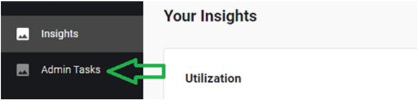
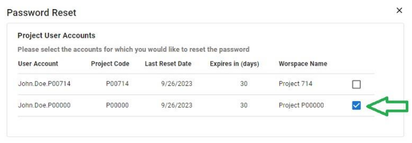
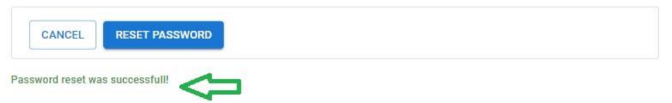
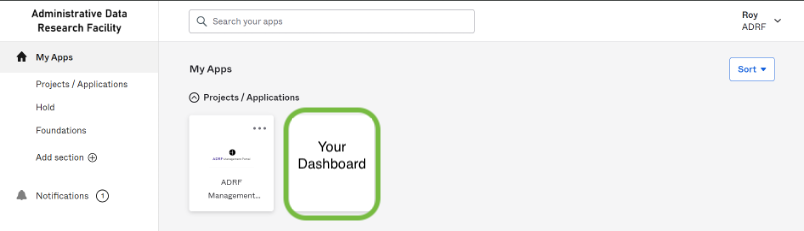
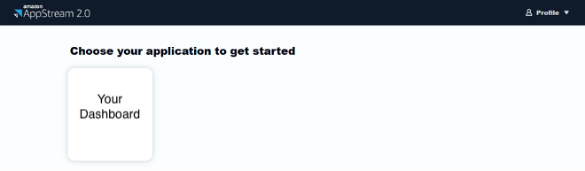
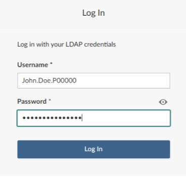

# 12 Accessing ADRF Dashboards

Some users will be approved to access an ADRF Dashboard. This section provides step-by-step instructions for accessing ADRF Dashboards.

**Note**: If you are a first-time ADRF Users, please follow the instructions in the [Onboarding Modules and Security Training](#3-onboarding-modules-and-security-training) to activate your ADRF account and complete your onboarding tasks.

## Topics

- [12 Accessing ADRF Dashboards](#12-accessing-adrf-dashboards)
  - [Topics](#topics)
  - [Step 1: Setting your dashboard access password](#step-1-setting-your-dashboard-access-password)
  - [Step 2: Accessing the Dashboard](#step-2-accessing-the-dashboard)

## Step 1: Setting your dashboard access password

Once you have completed the management portal onboarding tasks, you will next need to set your **dashboard access password**. This is separate from the first password you use to access the ADRF through Okta, and will instead be used to provide specific access to the dashboard. **You should only need to do this the first time you access the dashboard, but you can always follow these instructions if you need to update or reset your dashboard access password in the future.**

1. In the Management Portal, again navigate to the “Admin Tasks” page by clicking the link on the sidebar navigation menu:

2. Click on the “Reset Password” button:

3. This will load the password reset window:

4. Select the account associated with the dashboard by clicking on the checkbox on the right:

**Important**: Take note of the username associated with your dashboard (John.Doe.P00000 in this example). You will need to enter this username again in the next step. This is also the user name referenced in your onboarding email.

5. Enter the desired password. The chosen password must adhere to the ADRF password policy:

6. Click the **“Reset Password”** button to proceed with the update. You will receive confirmation at the bottom of the window once the password has been successfully updated:

## Step 2: Accessing the Dashboard

Once you have successfully reset your dashboard access password, you are ready to access the dashboard. To do so, navigate back to the main Okta portal (adrf.okta.com) and click on the tile associated with your dashboard. **This tile will be unavailable until you complete the three ADRF onboarding tasks discussed in [Onboarding Modules and Security Training](#3-onboarding-modules-and-security-training)**:

Clicking on this will bring up another window where you will be prompted to **“Choose Your Application to Get Started.”** Click on your **Dashboard icon**:

Next, you will need to wait for your session to be prepared. Then, your session will load the secure browser window, which will then bring up the Posit Connect portal. The Posit Connect portal is used to host the Dashboard. **This step may take several seconds while the browser loads and prepares the dashboard data.**

Before accessing the dashboard, you will then be presented with one final request to log into the **secure Connect environment.**:

Here, please enter:

1. The username you saw in the Password Reset step above (e.g., John.Doe.P00000)
2. Your dashboard access password that you set in Step 2.

Once you enter the appropriate information and click “Log In,” your dashboard should begin to load. This again may take a minute or two - if you run into any issues, please reach out to us at [support@coleridgeinitiative.org](mailto:support@coleridgeinitiative.org).

---

[⬅️ Previous: Redshift Querying Guide](11-querying-guide.md) | [Back to Home](index.md) | [Next: Pass Portal Password Reset ➡️](13-pass_reset_password.md))
